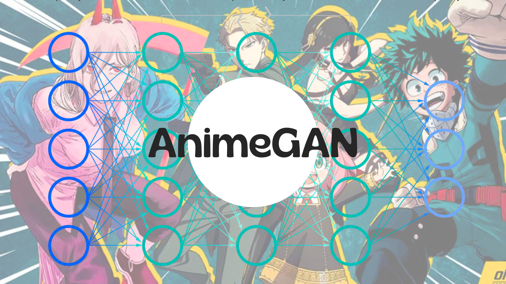
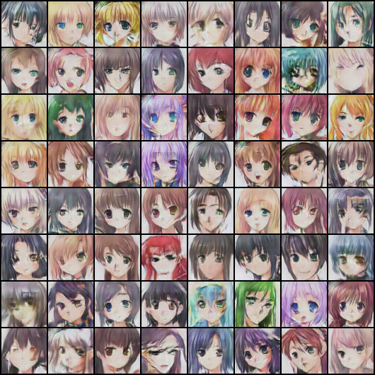

# AnimeGAN

Hello 🎃

Animes are most people's favourite. So, how cool would it be to generate anime faces? It would be super cool! Let's do that then.

In recent time I had a chance to give a workshop about GANs called **"GAN for Image Generation"**. First I followed DCGAN implementation with Anime Face dataset to generate Anime faces. I, then, think about what I learned from GAN Specilization course on Coursera. Wasserstein Loss.

Normally, you're go to loss function for GAN is binary cross entropy loss since what discriminator does is to predict if the image given is real or fake. And discriminator being easy to train comparing to generator, it is likely that it is going to be good earlier than generator. The feedback it will give to the generator will probably be not usefull. Because the gradient will be close to zero and it is not going to help generator to get better. That's why Wassersteion Loss is more accurate than binary cross entropy loss. I'm not going to go detail in here 👾

I used DCGAN architecture but then I changed the final layer of discriminator from `Sigmoid` to `Linear`. Wasserestein Loss works on the idea that the output of discriminator is a **score**. Making it linear will give that to us. Here is the DCGAN architecture:

In notebook, discriminator's input shape is 64x64x3 and output is a score. Generator's input shape is 128x1x1 (latent size = 128) and output shape is 64x64x3, since it is the input of discriminator.

Epoch is 25. You can train it longer. But the results are good enough for now. It took 1 hour in Google Colab. 

> A note in here, in M1 Pro Apple chip this code does not work, I couldn't make it work maybe I am not sure yet. It works but giving no valuable outputs. And on VSCode and PyCharm, it throws type errors etc. You'll see error at the end of the notebook but it is becaues of the M1 Pro chip. The code works fine on Colab.

So, here is some things I tried along the to get here:

- First I used binary cross entropy loss, BCELoss. [Content](https://github.com/GuldenizBektas/AnimeGAN/tree/main/content/generated) folder contains the outputs. The final result:

    

    The video of generated images is [`output.mp4`](https://github.com/GuldenizBektas/AnimeGAN/blob/main/output.mp4):
    
    <video src="https://user-images.githubusercontent.com/72661473/198141763-182dc7ab-240f-4ef3-a1c3-657493096588.mp4" controls="controls" style="max-width: 730px;">
    </video>

- I used binary cross entropy loss with logits, BCEwithLogitLoss. [Content 2](https://github.com/GuldenizBektas/AnimeGAN/tree/main/content%202/generated) folder contains the outputs. The final result:

    

    The video of generated images is [`output2.mp4`](https://github.com/GuldenizBektas/AnimeGAN/blob/main/output2.mp4):
    
    <video src="https://user-images.githubusercontent.com/72661473/198142120-d4222496-b4a0-4ea1-a93b-389e4cf05ec4.mp4" controls="controls" style="max-width: 730px;">
    </video>

- I used Wasserstein Loss without Gradient Penalty. [Content 3](https://github.com/GuldenizBektas/AnimeGAN/tree/main/content%203/generated) folder contains the outputs. The final result:

    

    The video of generated images is [`output3.mp4`](https://github.com/GuldenizBektas/AnimeGAN/blob/main/output3.mp4):
    
    <video src="https://user-images.githubusercontent.com/72661473/198142194-1ee338e8-02de-42c0-ba75-919e11a1cdec.mp4" controls="controls" style="max-width: 730px;">

- I used Wasserstein Loss with Gradient Penalty. [Content 4](https://github.com/GuldenizBektas/AnimeGAN/tree/main/content%204/generated) folder contains the outputs. The final result:

    

    The video of generated images is [`output4.mp4`](https://github.com/GuldenizBektas/AnimeGAN/blob/main/output4.mp4):
    
    <video src="https://user-images.githubusercontent.com/72661473/198142288-d1176406-0643-4588-ac0d-52c3fd503c40.mp4" controls="controls" style="max-width: 730px;">

Did you notice the difference? Colors especially. I bet it can be better. So, I'll leave you to it.

Have fun 🙌🏾
